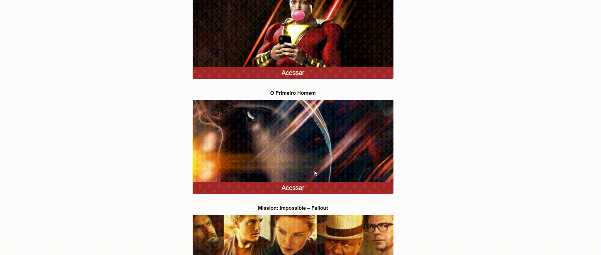

<div align="center">
  <sub>Projeto feito com 💜  Por
    <a href="https://github.com/ismaelgomesdasilva">Ismael Gomes</a>       
  </sub>
</div>


# :eyes: Demonstração
 
 Hospedado em: https://projeto-filmaria-ismael.netlify.app/

# :computer: Tecnologias
Esse projeto foi feito em:

* JavaScript     
* React    
     

# :rocket: Sobre

Projeto de catologos de filmes, Nele é possivel adicionar a lista de favoritos, deletar e ver trailer.


# :construction_worker: Clone o Repositorio
```bash
# Clone Repository
$ git clone https://github.com/ismaelgomesdasilva/filmaria.git
```

### 💻 Executar projeto da Web

```bash
# Install Dependencies
$ yarn install or npm install


